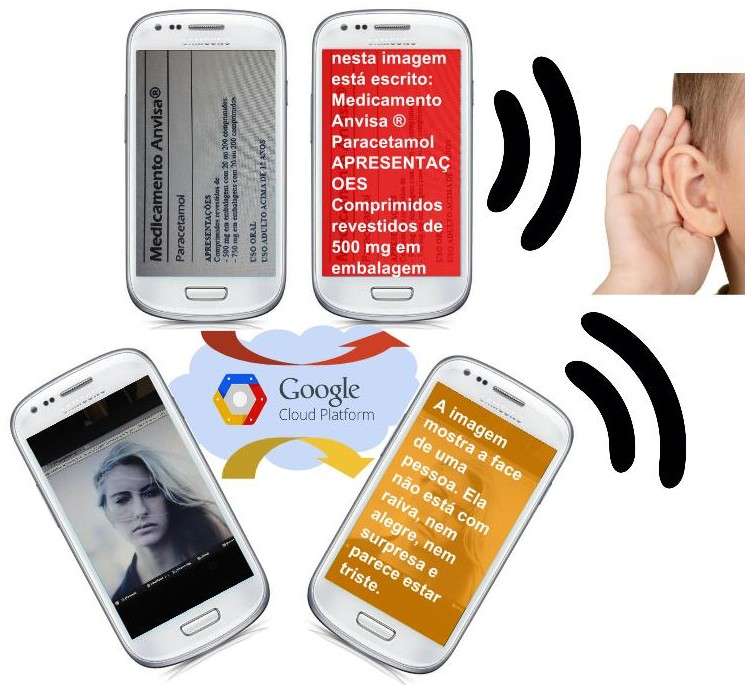
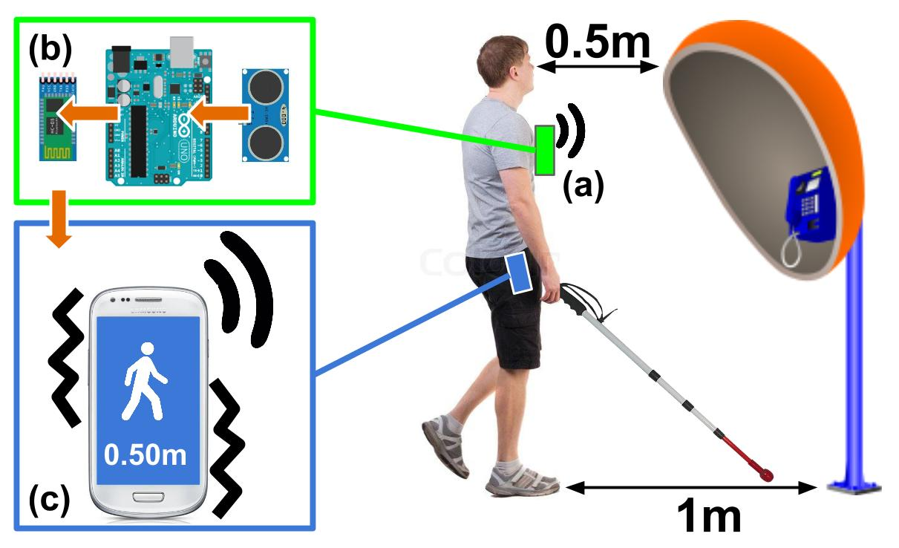
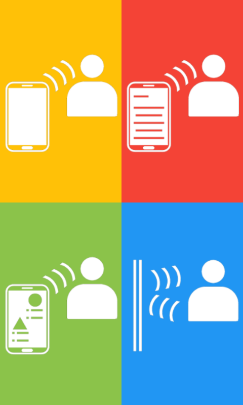
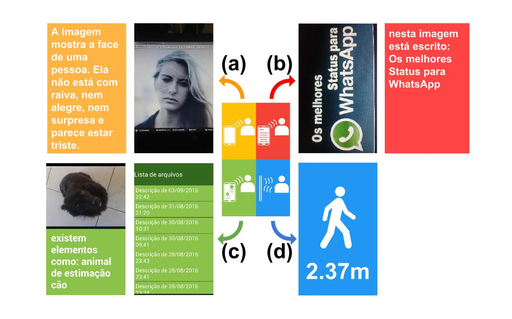
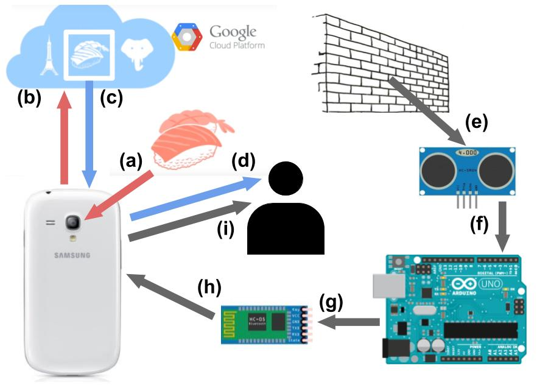

# E-Eyes Project

This project consists of a system designed to help people with different levels of visual impairement. Mannaged by an Android app, it tells the user, in an easy to use interface, the content of texts, facial expressions and object labeling. In the other side of the system, it also detects obstacles using an Arduino with sensor and Bluetooth module.

This project was developed as an end of course project in Computer Engineering, with all support of Universidade de São Paulo

## Contact: 
* guilhermegsiqueira1@gmail.com
* guilherme.galdino.siqueira@alumni.usp.br

## Reference:
http://www.tcc.sc.usp.br/tce/disponiveis/97/970010/tce-05012017-115432/

## Image Recognition Features

## Obstacles Detection

## Main Menu

## Main Menu And Sub Menus

## Schematic Model

